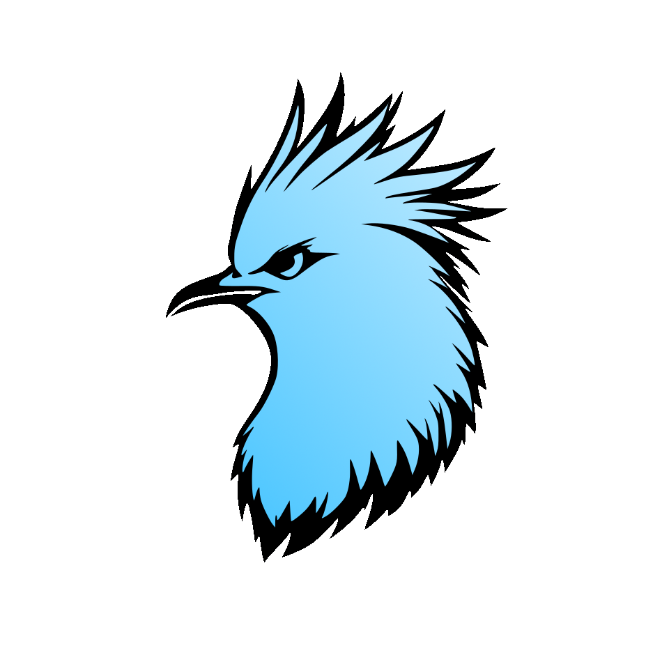

<div align="center">

# Kagu Engine

*3D Game Engine made with Vulkan*



[](https://github.com/dark-dylan-dev/KaguEngine/actions)
[](LICENSE.txt)

## Table of Contents

</div>

 - [Clone the repository](#clone-the-repository)
 - [Update the repository](#update-the-repository)
 - [Project dependencies](#project-dependencies)
 - [Building the engine](#building-the-engine)
 - [License](#license)

<div align="center">

## Clone the repository

</div>

 - Clone the repository and all its submodules with :
```bash
git clone --recursive https://github.com/dark-dylan-dev/KaguEngine
cd KaguEngine
```
> The `--recursive` flag ensures that the submodules are cloned.

<div align="center">

## Update the repository

</div>

 - Inside the `KaguEngine/` directory, run :
```bash
git checkout master
git pull
git submodule update --init --recursive
```
> The last command updates the submodules.

<div align="center">

## Project dependencies

</div>

 - [Vulkan SDK](https://vulkan.lunarg.com/)
 - [CMake](https://cmake.org/download/)

Linux dependencies
```bash
# Debian, Ubuntu
sudo apt-get update
sudo apt-get install -y libxkbcommon-dev libxinerama-dev libxcursor-dev libxi-dev libgl1-mesa-dev

# Arch Linux
sudo pacman -Syu
sudo pacman -S --noconfirm libxkbcommon xorg-xinerama xorg-xcursor libxi mesa

# Fedora, RedHat
sudo dnf makecache
sudo dnf install -y libxkbcommon-devel libXinerama-devel libXcursor-devel libXi-devel mesa-libGL-devel
```

<div align="center">

## Building the engine

</div>

 - Inside the `KaguEngine/` directory, run :
```bash
cmake -B build -DCMAKE_BUILD_TYPE=Release
cmake --build build --config Release
```
> Available build configurations : Debug, Release, RelWithDebInfo, MinSizeRel

<div align="center">

## License

</div>

Kagu Engine is licensed under the [MIT License](LICENSE.txt).